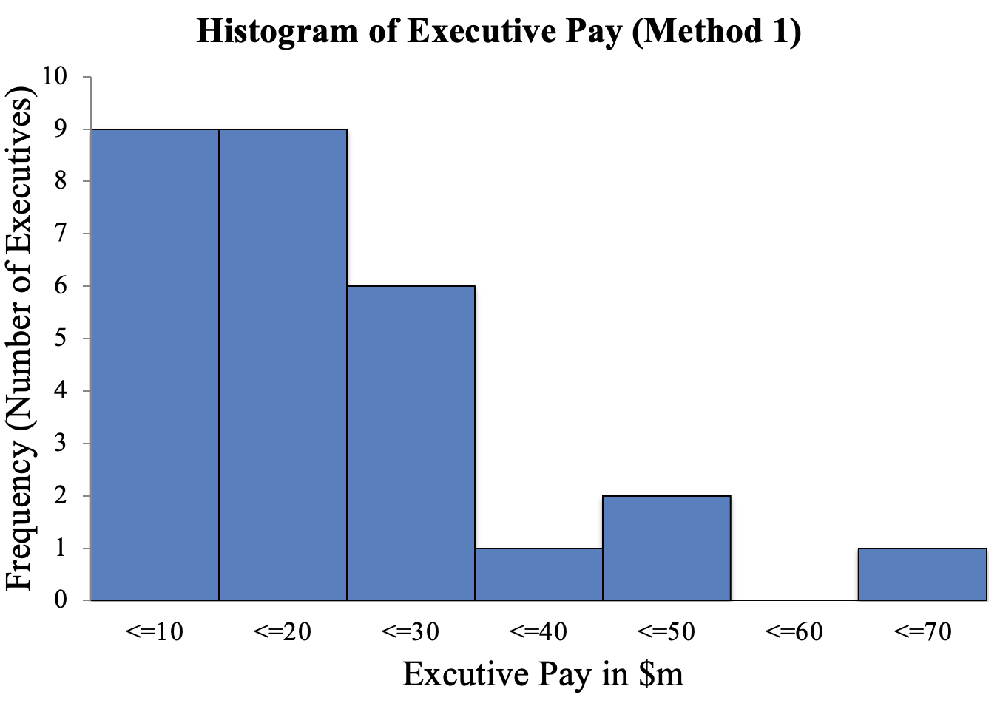
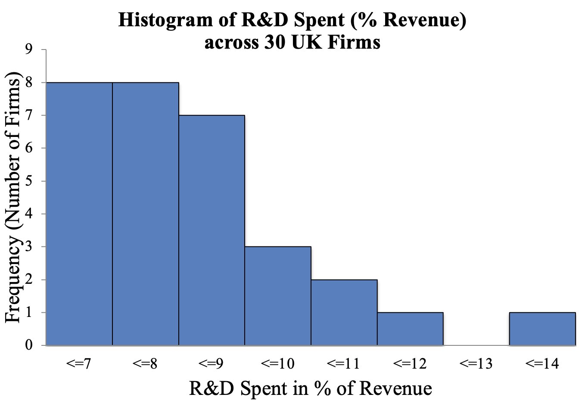
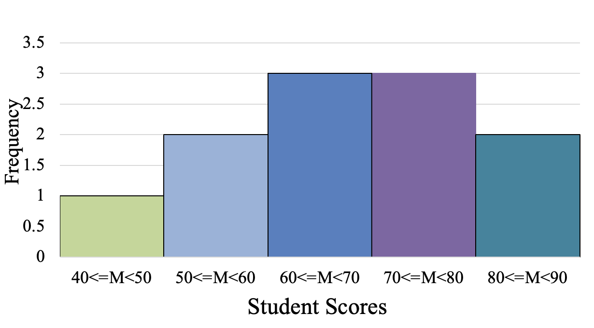

## Exercise 1

What sort of display would be most suitable for the following data?

1.  The **amount of taxation** paid by a light engineering company and **its annual profit** for **20 consecutive years.**

    . . .

    **A:** This is a comparison between 2 numerical measures. Hence, a scatter plot would be the most suitable.

    . . .

2.  The **types** of premises occupied by all the small businesses in a town – **office, factory, warehouse,** etc.

    . . .

    **A:** These are categorical variables. Hence, Bar Chart or Pie Chart would be the most suitable visualisation.

## Exercise 1 (Cont'd)

3.  The **salary** of a trainee accountant in his/her first year of training at 30 major accountancy firms.

    . . .

    **A:** There is one numerical measure (salaries). Hence, Histogram or Stem & Leaf would be the most suitable visualisation.

    . . .

4.  The **number of trainee accountants** enrolling for professional examinations **each year since 1960**.

    . . .

    **A:** Although there is only one numerical measure, but it must be illustrated with respect to time. Therefore, Time Series Plot would be most suitable.

## Exercise 1 (Cont'd)

5.  The **number of years of experience** and **the current salary** of a random sample of economists working for a New York bank.

    . . .

    **A:** This is a comparison between 2 numerical measures. Hence, a scatter plot would be the most suitable.

## Exercise 2

In one year, the executive pay, including salary and bonus, in millions of dollars, for 28 chairpersons and chief executive officers are presented in the table below. Display these data by drawing a histogram using Excel. \vspace{10pt} 

```{=latex}
\begin{table}
\centering
\tiny
\resizebox{0.8\textwidth}{!}{
\begin{tabular}{lrlr}
\toprule
Company & Value & Company & Value \\
\midrule
Boeing & 21.12 & Coca-Cola & 21.60 \\
Whirlpool & 12.93 & DuPont & 12.73 \\
Bank of America & 12.00 & Motorola & 47.15 \\
Sherwin-Williams & 11.00 & Marriott & 8.58 \\
Bristol-Myers Squibb & 16.00 & Honeywell & 16.28 \\
General Mills & 12.19 & Exxon & 34.90 \\
Hillshire Brands & 6.40 & CBS & 60.25 \\
Wal-Mart & 20.70 & AT\&T & 21.00 \\
Apple & 4.17 & Philip Morris & 24.73 \\
Goodyear & 13.43 & Tesco & 1.90 \\
Teledyne & 3.21 & EasyJet & 6.40 \\
Delta Airlines & 12.58 & Shell & 5.10 \\
Chrysler & 1.23 & GlaxoSmithKline & 6.39 \\
\bottomrule
\end{tabular}
}
\end{table}
```

## Exercise 2 (Cont'd)

{fig-align="center" width=85% height=85%}

## Exercise 3

A financial analyst is interested in the amount of resources spent by computer companies on Research and Development (R&D). She samples 30 such firms and calculates the percentage of total revenue they spent on R&D in the last year. The results are given below. Summarize these data using by using: a) the frequencies, b) the relative frequencies, c) a histogram.

```{=latex}
\begin{table}
\centering
\tiny
\resizebox{0.8\textwidth}{!}{
\begin{tabular}{llllll}
\toprule
Company & (\%) & Company & (\%) & Company & (\%) \\
\midrule
1  &  6.0 & 11 &  7.9 & 21 &  8.0 \\
2  & 10.4 & 12 &  6.8 & 22 &  7.7 \\
3  & 10.5 & 13 &  7.4 & 23 &  7.4 \\
4  &  9.0 & 14 &  9.5 & 24 &  6.5 \\
5  &  7.3 & 15 &  8.1 & 25 &  9.5 \\
6  &  6.6 & 16 & 13.5 & 26 &  8.2 \\
7  &  6.9 & 17 &  9.9 & 27 &  6.9 \\
8  &  8.2 & 18 &  6.9 & 28 &  7.2 \\
9  &  7.1 & 19 & 11.1 & 29 &  8.2 \\
10 &  8.1 & 20 &  8.2 & 30 &  6.7 \\
\bottomrule
\end{tabular}
}
\end{table}
```

Also, use the histogram to deduce the proportion of companies that spend **more than 9%** on R&D.

## Exercise 3 (Cont'd)

**A:** For a) and b) \vspace{10pt}

```{=latex}
\begin{table}
\centering
\normalsize
\resizebox{0.65\textwidth}{!}{
\begin{tabular}{ccc}
\toprule
\textbf{Bin} & \textbf{Frequency} & \textbf{Relative Frequency} \\
\midrule
7  &  8 & 26.7\% \\
8  &  8 & 26.7\% \\
9  &  7 & 23.3\% \\
10 &  3 & 10.0\% \\
11 &  2 &  6.7\% \\
12 &  1 &  3.3\% \\
13 &  0 &  0.0\% \\
14 &  1 &  3.3\% \\
\midrule
\textbf{Total} & \textbf{30} & \textbf{100\%} \\
\bottomrule
\end{tabular}
}
\end{table}
```

## Exercise 3 (Cont'd)

For c) \vspace{10pt}

{fig-align="center" width=75% height=75%}

Therefore, 7/30 companies spend 9% or more on R&D.

## Exercise 4

Choosing a suitable leaf unit, draw a stem and leaf diagram **by hand** for the list of executive salaries given below in thousands of pounds. The data are: \vspace{10pt}

```{=latex}
\begin{table}
\centering
\scriptsize
\resizebox{0.7\textwidth}{!}{
\begin{tabular}{ccccc}
\toprule
846 & 457 & 563 & 1466 & 1200 \\
2164 & 746 & 1611 & 824 & 824 \\
1310 & 1007 & 1367 & 575 & 1252 \\
1354 & 2479 & 1238 & 927 & 1253 \\
925 & 1284 & 1279 & 1660 & 860 \\
\bottomrule
\end{tabular}
}
\end{table}
```

## Exercise 4 (Cont'd)

**A:** Taking a stem unit of 1000 and leaf unit of 100 gives only three classes but allowing two rows for each stem unit overcomes this. We have rounded to obtain the leaf unit. For example, the first data point (846) can be approximated to 800, which is written in the form of 0 × 1000 + 8 × 100. This means that the number of stem is zero and there are 8 leaves. Consider another example: 2164 is approximated to 2200 and is written as 2 × 1000 + 2 × 100. Repeating this, the original data becomes: \vspace{10pt}

```{=latex}
\begin{table}
\centering
\tiny
\resizebox{0.7\textwidth}{!}{
\begin{tabular}{ccccc}
\toprule
800 & 500 & 600 & 1500 & 1200 \\
2200 & 700 & 1600 & 800 & 800 \\
1300 & 1000 & 1400 & 600 & 1300 \\
1400 & 2500 & 1200 & 900 & 1300 \\
900 & 1300 & 1300 & 1700 & 900 \\
\bottomrule
\end{tabular}
}
\end{table}
```

## Exercise 4 (Cont'd)

**A:** The above data can be presented as follows: \vspace{10pt}

```{=latex}
\begin{table}
\centering
\tiny
\resizebox{0.6\textwidth}{!}{
\begin{tabular}{cl}
\toprule
\textbf{Stem (×1000)} & \textbf{Leaves (×100)} \\
\midrule
0 & 8\;5\;6\;7\;8\;8\;6\;9\;9\;9 \\
1 & 2\;3\;0\;4\;3\;4\;2\;3\;3\;3 \\
1 & 5\;6\;7 \\
2 & 2 \\
2 & 5 \\
\bottomrule
\end{tabular}
}
\end{table}
``` 

## Exercise 5

Estimate the average, median, and standard deviation of the original data, which is presented by the following histogram.

{fig-align="center"}

## Exercise 5 (Cont'd)

**A:** We can only guess what the data points in each bin are. For instance, a data point located in the first bin $(40 \le M < 50)$ can be $40, 40.12, 45$, etc. A reasonable way is to assume that this data point is in the middle of the first bin. Therefore, we assume the first data point is 45. Using the same argument, we assume that the two data points located in the second bin are equal to the middle of the second bin (55). Thus, the data set can be assumed as follows:

\vspace{5pt}
```{=latex}
\scriptsize
\begin{table}
\centering
\begin{tabular}{ccccccccccc}
1 & 2 & 3 & 4 & 5 & 6 & 7 & 8 & 9 & 10 & 11 \\[3pt]
45 & 55 & 55 & 65 & 65 & 65 & 75 & 75 & 75 & 85 & 85 \\
\end{tabular}
\end{table}
\normalsize
```

Hence,

* $\text{Mean} = \frac{\sum_{i=1}^{n} X_i}{n} = \frac{45 + 55 + \cdots + 85 + 85}{11} = \frac{745}{11} = 67.727$

* $\text{Median} = X_{\frac{11+1}{2}} = X_6 = 65$

* $\text{Mode: } 65 \text{ and } 75$
 
## Exercise 5 (Cont'd)

* Variance:
    $$
    \begin{aligned}
    S^2 & = \frac{\sum_{i=1}^{n}(X_i - \bar{X})^2}{n - 1} \\
                       &= \frac{(45 - 67.72)^2 + (55 - 67.72)^2 + \cdots + (85 - 67.72)^2}{11 - 1}  \\ 
                       &= \frac{1618.18}{10} = 161.81
    \end{aligned}
    $$

* $\text{Standard Deviation: } S = \sqrt{161.81} = 12.720$
