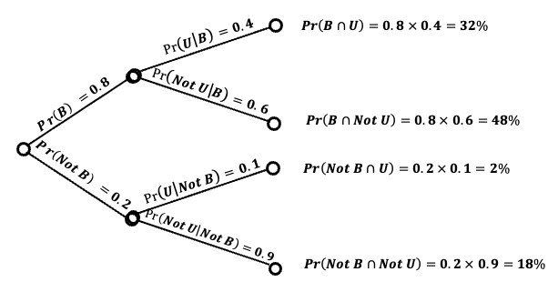

## Exercise 1

1.  A university has three residences for students. The first has 500 single study bedrooms, the second has 1000 and the third has 2000. When a student is allocated randomly to a residence, what is the probability of the second residence?

    . . .

    $$
     \begin{aligned}
     \text{Pr}(\textit{Second Residence}) & = \frac{n(\textit{Second Residence})}{n(\textit{Total})} \\
                                          & = \frac{1000}{500 + 1000 + 2000} 
                                            = \frac{1000}{3500} 
                                            = \frac{2}{7}
     \end{aligned}
     $$

## Exercise 1 (Cont'd)

2.  Five men and three women are short-listed for a job. What is the probability that a man gets the job? What assumption do you need to make to calculate the probability? 

    $$
     \text{Pr}(\textit{Man}) = \frac{n(\textit{Man})}{n(\textit{Total Short - listed})} = \frac{5}{5 + 3} = \frac{5}{8}  
     $$
    
    \vspace{5pt}
    
    We assume that the chance of each person to get the job is the **same**. That is, the events of the job taken by each of these eight candidates are **equally** likely.

## Exercise 2

In a particular city 20% of people subscribe to the morning newspaper, 30% to the evening newspaper and 10% subscribe to both. Determine the probability that an individual from this city subscribes to the morning newspaper or the evening newspaper or both. Are the events, ‘subscribe to morning newspaper’, and ‘do not subscribe to morning newspaper’ mutually exclusive or not? Say why or why not.

. . .

**A:** Define set $A$ as people who subscribe to the morning newspaper and set $B$ as people who subscribe to the evening newspaper.

We are told $\Pr(A) = 0.20$, $\Pr(B) = 0.30$, and $\Pr(A \cap B) = 0.10$.\
To find $\Pr(A \cup B)$, we can use the inclusion–exclusion rule as follows:

$$
\begin{aligned}
\Pr(A \cup B) & = \Pr(A) + \Pr(B) - \Pr(A \cap B) \\
              & = 0.20 + 0.30 - 0.10 \\
              & = 0.40 
\end{aligned}
$$

## Exercise 2 (Cont'd)

In the above notation, $A \cap B$ means both events $A$ **and** $B$ have occurred (the person subscribes to both morning and evening newspapers), and $A \cup B$ means either $A$ **or** $B$ or **both** has occurred (the person subscribes either to both morning or to evening newspapers **or both**).

The events $A$ (subscribe to the morning newspaper) and $Not \; A$ (not subscribe to the morning newspaper) are **mutually exclusive** because they cannot happen simultaneously. In other words:

$$
\Pr(A \cap Not \; A) = 0
$$

## Exercise 3

A taxi company runs 4 taxis. Two are older and the probability that a particular one of these breaks down on a particular day is 0.1. The other two are newer and the probability that a particular one breaks down on a particular day is 0.05. On a particular day: \vspace{10pt}

. . .

-   Define A as the event that the first old taxi breaks down

-   Define B as the event that the second old taxi breaks down

-   Define C as the event that the first new taxi breaks down

-   Define D as the event that the second new taxi breaks down

## Exercise 3 (Cont'd)

1.  What is the probability that all 4 taxis break down? State any assumptions you make.

    . . .

    **A:** Assuming that events A, B, C, D are all **independent**, the probability that all 4 taxis break down is:

    $$
     \begin{aligned}
     \Pr(\textit{All Break Down}) &= \Pr(A \; and \; B \; and \; C \; and \; D) \\
     & = \Pr(A)\Pr(B)\Pr(C)\Pr(D) \\
     & = 0.1 \times 0.1 \times 0.05 \times 0.05 \\
     & = 0.000025
     \end{aligned}
     $$

## 

2.  What is the probability that the two newer taxis break down but the older ones continue to work?

    . . .

    **A:** The probability that the two newer taxis break down but the older ones continue to work is

    $$
     \begin{aligned}
     & \Pr(\textit{Old not Break Down and New Break Down}) \\ 
     & = \Pr(Not \; A \; and \; Not \; B \; and \; C \; and \; D) \\
     & = \Pr(Not \; A)\Pr(Not \; B)\Pr(C)\Pr(D) \\
     & = (1 - 0.1) \times (1 - 0.1) \times 0.05 \times 0.05 \\
     & = 0.9 \times 0.9 \times 0.05 \times 0.05 \\
     & = 0.002025
     \end{aligned}
     $$

## Exercise 4

Consider the data in the contingency table below, giving the number of male and female students on various degree courses in the business school of a university. There are 1500 students in total. \vspace{-5pt}

$$
\footnotesize
\begin{array}{lcccc}
\toprule
 & \textbf{Accountancy} & \textbf{Economics} & \textbf{Finance} & \textbf{Business Information} \\
\midrule
\text{Male}   & 330 & 360 & 90 & 120 \\
\text{Female} & 120 & 390 & 60 & 30 \\
\bottomrule
\end{array}
$$

\vspace{10pt}

Calculate the following probabilities:

1.  The probability that a student takes Economics.

. . .

$$
\Pr(\text{Economics}) = \frac{750}{1500} = \frac{1}{2} = 0.50
$$

## Exercise 4 (Cont'd)

2.  The probability that **a female** student takes Economics.

    . . .

    $$
    \begin{aligned}
    \Pr(\textit{Economics} \, | \, \textit{Female}) & = \frac{\Pr(\textit{Economics}\cap\textit{Female})}{\Pr(Female)} \\ & = \frac{\frac{390}{1500}}{\frac{600}{1500}} = 0.65 \\
    \end{aligned}
    $$

3.  The probability that a student is female **and** takes Economics.

    . . .

    $$
    \begin{aligned}
    \Pr(\textit{Economics} \, \cap \, \textit{Female}) & = \frac{n(\textit{Economics} \cap \textit{Female})}{n(\textit{Total})} \\ & = \frac{390}{1500} = 0.26 \\
    \end{aligned}
    $$

## 

4.  The probability that a student takes Economics **given that** they are female:

    . . .

    This is the same as part b

5.  The probability that **a Finance** student is female.

    . . .

    $$
    \begin{aligned}
    \Pr(\textit{Female}\,| \,\textit{Finance}) & = \frac{\Pr(\textit{Female} \cap \textit{Finance})}{\Pr(\textit{Finance})} \\ & = \frac{\frac{60}{1500}}{\frac{150}{1500}} = \frac{60}{150}= 0.4
    \end{aligned}
    $$

## 

6.  The probability that a student is female given that they do Finance.

    . . .

    This is the same as part e.

7.  Are the events ’student is female’ and ‘student takes Economics’ independent or not? Explain your answer.

    . . .

    We know that $\Pr(\textit{Economics}\, | \, \textit{Female}) = 0.65$, $\Pr(\textit{Economics}) = 0.50$. Since $\Pr(\textit{Economics}\, | \, \textit{Female}) \neq \Pr(\textit{Economics})$, we conclude that two events are not independent (i.e. they are dependent).

## Exercise 5

A software company surveyed office managers to determine the probability that they would buy a new graphics package; 80% of the managers said they would buy the package. Of these, 40% were also interested in upgrading their computer hardware. Among those managers who were not interested in purchasing the graphics package only 10% were interested in upgrading their computer hardware.

Denote event B, "manager would buy package" and event U, "manager would upgrade".

## Exercise 5 (Cont'd)

1.  Write down the percentage information supplied above in terms of probabilities and the events B, Not B, U and Not U.

    . . .

    -   Define event B as the manager would Buy the package

    -   Define event U as manager would Upgrade the hardware.

    Unconditional probabilities: the question text said that 80% of the managers would buy the package. Hence, $\Pr(B) = 80\%$ and $\Pr(Not \, B) = 20\%$.

    Conditional probabilities: the question text said that among these (managers who buy), 40% were also interested in upgrading their computer hardware. Hence, $\Pr(U|B) = 40\%$ and $\Pr(Not \, U \,| \,B)=60\%$. In addition, the question text said that of those managers who were not interested in buying only 10% were interested in upgrading. Hence, $\Pr(U \, | \, Not\, B)=10\%$ and $\Pr(Not\, U \, |Not\, B)=90\%$.

## 

2.  Using a tree diagram or otherwise calculate the probability that an office manager who is interested in upgrading is also interested in purchasing the new graphics package.
    
    **A:** The probability that an office manager **who is interested in upgrading (conditional term)** is also interested in buying the new graphics package is $\Pr(B\,|\,U)$. By using the definition and values derived in the tree diagram, we can find this condition probability as follows:

    $$
     \Pr(B\,|\,U) = \frac{\Pr(B \cap U)}{\Pr(U)} = \frac{32\%}{32\% + 2\%} = \frac{32}{34} = 0.94
     $$
     
## 

\vspace{10pt}

    
## Exercise 6

Students are given 3 chances to pass a professional examination. A student who has passed is selected at random. The probability distribution of X, the attempt number at which this student passed is given as \vspace{-5pt}

$$
P(x) = \frac{0.4^{x -1} 0.6}{0.936} \quad \text{for} \; x = 1,2 \; \text{and} \; 3
$$

Write out the probability distribution of X. What proportion of students pass at the third (i.e. final) attempt?

## Exercise 6 (Cont'd)

**A:** The probability distribution formula is given as follows:

$$
P(x) = \frac{0.4^{x -1} 0.6}{0.936}
$$

\vspace{5pt}
which presents the probability of passing the exam at attempt $x$. Substitute $x = 1, 2, 3$ and find: 

$$
\begin{aligned}
P(1) &= \frac{0.4^{1 -1} 0.6}{0.936} = \frac{1 \times 0.6}{0.936} = 0.6410 \\
P(2) &= \frac{0.4^{2 -1} 0.6}{0.936} = \frac{0.4 \times 0.6}{0.936} = 0.2564 \\
P(3) &= \frac{0.4^{3 -1} 0.6}{0.936} = \frac{0.4^2 \times 0.6}{0.936} = 0.1026
\end{aligned}
$$

## 

Hence, we have the following probability distribution: 

$$
\begin{array}{c|c}
\toprule
\textbf{x} & \textbf{Pr}(x) \\
\midrule
1 & 0.6410 \\
2 & 0.2564 \\
3 & 0.1026 \\
\bottomrule
\end{array}
$$

Therefore, 10.26% of students pass the exam at the third attempt.

## Exercise 7

Two courier firms are competing for a contract to deliver in the City of London for an investment company. Both have provided figures, based on historic data, for the probability of delivery times of $\frac{1}{2}$, 1, $1 \frac{1}{2}$ and 2 hours.

Calculate the mean and variance of the delivery time for both courier firms. Based on these which would you employ and why?

## Exercise 7 (Cont'd)

**A:** We want to calculate the mean and variance of a random variable (delivery time for two courier firms) using the following table. We expand the table by adding two columns $xP(x)$ and $x^2 P(x)$:

\vspace{-10pt}
$$
\centering
\tiny
\begin{array}{c|ccc|c|ccc}
\toprule
\multicolumn{4}{c|}{\textbf{Firm A}} & \multicolumn{4}{c}{\textbf{Firm B}} \\
\midrule
x & \Pr(x) & x\Pr(x) & x^{2}\Pr(x) & x & \Pr(x) & x\Pr(x) & x^{2}\Pr(x) \\
\midrule
0.5 & 0.6 & 0.3 & 0.5^{2}\times0.6=0.15 & 0.5 & 0.1 & 0.05 & 0.5^{2}\times0.1=0.025 \\
1   & 0.1 & 0.1 & 1^{2}\times0.1=0.10   & 1   & 0.7 & 0.7  & 1^{2}\times0.7=0.70 \\
1.5 & 0.1 & 0.15 & 1.5^{2}\times0.1=0.225 & 1.5 & 0.15 & 0.225 & 1.5^{2}\times0.15=0.3375 \\
2   & 0.2 & 0.4 & 2^{2}\times0.2=0.80   & 2   & 0.05 & 0.10 & 2^{2}\times0.05=0.20 \\
\midrule
\textbf{Sum} & 1 & 0.95 & 1.275 & & 1 & 1.075 & 1.2625 \\
\bottomrule
\end{array}
$$

## 

* Firm A:
    
    We calculate the $E(X)$ and $E(X^2)$ as follows:
    
    $$
    \begin{aligned}
    \mu = E(X) &= \sum X \times P(x) = 0.95 \\ 
    E(X^2) &= \sum X^2 \times P(x) = 1.275
    \end{aligned}
    $$
    
    Therefore, using the formula for mean and variance we find that \vspace{-12.5pt}
    
    $$
    \begin{aligned}
    \mu &= 0.95 \\ 
    Var(X) &= E(X^2) - \mu^2 = 1.275 - 0.95^2 = 0.3725
    \end{aligned}
    $$

## 

* Firm B:
    
    We calculate the $E(X)$ and $E(X^2)$ as follows:
    
    $$
    \begin{aligned}
    \mu = E(X) &= \sum X \times P(x) = 1.075 \\ 
    E(X^2) &= \sum X^2 \times P(x) = 1.2625
    \end{aligned}
    $$
    
    Therefore, using the formula for mean and variance we find that \vspace{-25pt}
    
    $$
    \begin{aligned}
    \mu &= 1.075 \\ 
    Var(X) &= E(X^2) - \mu^2 = 1.2625 - 1.075^2 = 0.10688
    \end{aligned}
    $$

##
 
Though the delivery time for firm B (1.075) is slightly longer and hence slightly worse than the delivery time for firm A (0.95), firm B’s delivery time is more consistent because its variance (0.107) is much lower than the variance of firm A’s delivery time (0.373). Therefore, we conclude that Firm B is better.