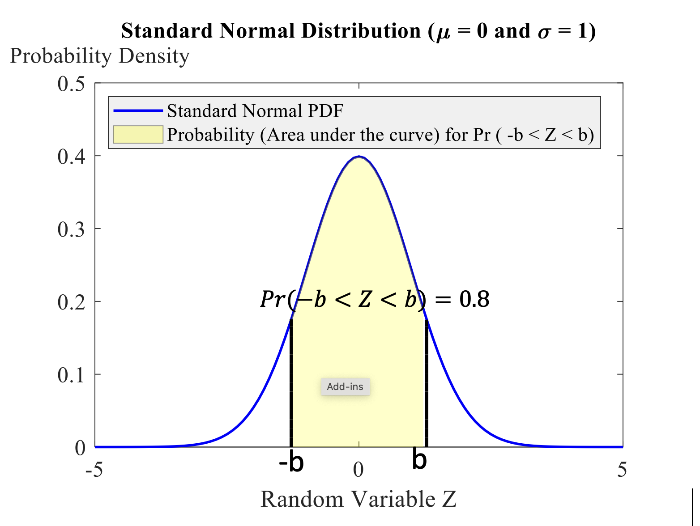
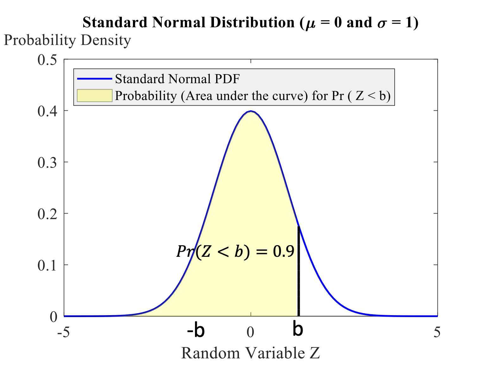

## Exercise 1

A financial analyst predicts that the return on Whizzco ordinary shares over the next 12-month period is equally likely to be any percentage between -2% and 4%. Assuming that the analyst is correct:

1.  Draw the probability density function (PDF) of the return, X, and write down its formula f(x).
    
    . . .
    
    **A:** This is a uniform distribution for a random variable $-2 = a \le X \le b = 4$, with the following probability density function (PDF): 

    $$
    f(x) = \frac{1}{b - a} = \frac{1}{4 - (-2)} = \frac{1}{6}
    $$

## Exercise 1 (Cont'd)

2.  Calculate the probability that the share has a positive return.
    
    . . .
    
    **A:** The probability that the return is positive ($X \ge 0$) is: \vspace{-4pt}

    $$
    \Pr(X \ge 0) = \text{length} \times \text{width} = 4 \times \frac{1}{6} = \frac{2}{3}
    $$

3.  Write down the mean and variance of the share’s return.

    . . .
    
    **A:** The mean of the uniform distribution is $\frac{a + b}{2}$, and the variance is 
    $\sigma^2 = \frac{(b - a)^2}{12}$. Thus,
    
    $\text{Mean} = \frac{(-2) + 4}{2} = 1$ and $\text{Variance} = \frac{(4 - (-2))^2}{12} = \frac{6^2}{12} = 3$

## Exercise 2

When Z is a standard normal random variable Pr(Z \< -1.5) = 0.0668. Deduce the following without using tables.

1.  $\Pr(Z > -1.5)$

    . . . 
    
    **A**: We know that $Z$ is a standard normal random variable and $\Pr(Z < -1.5) = 0.0668$. Hence: \vspace{-15pt}
    
    $$
    \Pr(Z > -1.5) = 1 - \Pr(Z < -1.5) = 1 - 0.0668 = 0.9332
    $$

2.  $\Pr(Z > 1.5)$

    . . .

    **A**: \vspace{-15pt}
    
    $$  
    \Pr(Z > 1.5) = \Pr(Z < -1.5) = 0.0668
    $$

## Exercise 2 (Cont'd)

3.  $\Pr(-1.5 < Z < 1.5)$

    . . .
    
    **A**: \vspace{-15pt}
    
    $$
    \begin{aligned}
    \Pr(-1.5 < Z < 1.5) &= 1 - 2 \Pr(Z < -1.5) \\ 
                        &= 1 - 2(0.0668) = 0.8664
    \end{aligned}
    $$

4.  $\Pr(|Z| > 1.5)$
    
    . . .
    
    **A**: \vspace{-20pt}
     
    $$
    \Pr(|Z| > 1.5) = 2 \Pr(Z < -1.5) = 2(0.0668) = 0.1336
    $$

## Exercise 3

Calculate the following assuming that $X \sim N(100,64)$.

1.  $\Pr(X > 120)$

    . . .
    
    **A**: 

    Because $X \sim N(100, 64)$, the random variable $X$ is normal, with mean 
    $\mu = 100$ and variance $\sigma^2 = 64$ (i.e., standard deviation $\sigma = 8$). Hence:
    
    $$
    \begin{aligned}
    \Pr(X > 120) 
    &= \Pr\left( \frac{X - 100}{8} > \frac{120 - 100}{8} \right) \\
    &= \Pr(Z > 2.5) \\
    &= 1 - \Pr(Z < 2.5) \\ 
    &= 1 - 0.9938 \\
    &= 0.0062 \\
    \end{aligned}
    $$

## Exercise 3 (Cont'd)

2.  $\Pr(X \leq 99)$ 

    . . .
    
    **A**: \vspace{-20pt}

    $$
    \Pr(X \le 99) 
    = \Pr\left( \frac{X - 100}{8} \le \frac{99 - 100}{8} \right) 
    = \Pr(Z \le -0.125)
    $$

    By symmetry, $\Pr(Z \le -0.125) = \Pr(Z \ge 0.125) = 1 - \Pr(Z < 0.125)$. Using interpolation between 0.5478 and 0.5517:

    $$
    \Pr(Z < 0.125) = \frac{0.5478 + 0.5517}{2} = 0.54975
    $$

    Thus,

    $$
    \Pr(X \le 99) = 1 - 0.54975 = 0.45025
    $$

## Exercise 3 (Cont'd)

3.  $\Pr(90< X < 100)$ 

    . . . 
    
    **A**: \vspace{-20pt}
    
    $$
    \begin{aligned}
    \Pr(90 < X < 100) 
    &= \Pr\left( \frac{90 - 100}{8} < \frac{X - 100}{8} < \frac{100 - 100}{8} \right) \\
    &= \Pr(-1.25 < Z < 0)
    \end{aligned}
    $$
    
    $$
    \begin{aligned}
    \Pr(-1.25 < Z < 0) &= \Pr(0 < Z < 1.25) \\
    &= \Pr(Z < 1.25) - \Pr(Z < 0) \\
    &= 0.8944 - 0.5 = 0.3944
    \end{aligned}
    $$

## Exercise 4

X has a normal distribution with a mean of $\mu=4$ and a standard deviation of $\sigma=1.5$. Find the critical value a such that $Pr(4-a < X < 4+a) = 0.8$.

. . .

**A**: This question asks us to find the range for a random variable, given a certain level of confidence (i.e., probability or area under the curve). Indeed, we need to find $a$ such that \vspace{-7pt}

$$
\Pr(4 - a < X < 4 + a) = 0.8
$$

First, standardize the random variable $X$:

$$
\begin{aligned}
\Pr\left( \frac{4 - a - 4}{1.5} < \frac{X - 4}{1.5} < \frac{4 + a - 4}{1.5} \right) 
&= 0.8 \\
\Pr\left( \frac{-a}{1.5} < Z < \frac{a}{1.5} \right) &= 0.8
\end{aligned}
$$

## Exercise 4 (Cont'd)

Define $\frac{a}{1.5} = b$. Hence, we have $\Pr(-b < Z < b) = 0.8$. What is the value of $b$ on the horizontal axis such that the area under the standard normal distribution between $-b$ and $b$ is equal to 0.8?

{fig-align="center" width="271"}

## Exercise 4 (Cont'd)

Considering the above shape, one can argue that the white area under the curve on the left is 10% and the white area under the curve on the right is also 10%. Thus, $\Pr(Z < b) = 0.9$

{fig-align="center" width="271"}

## Exercise 4 (Cont'd)

Searching for 0.90 among the numbers (probabilities) in the $Z$-table, we find that there is 0.8997 located at the intersection of 1.2 and 0.08, and 0.9015 located at the intersection of 1.2 and 0.09, which means that $\Pr(Z < 1.28) = 0.8997$ and $\Pr(Z < 1.29) = 0.901$.
Therefore, $b$ must be between 1.28 and 1.29 and should be closer to 1.28. If $b = 1.28$, then

$$
a = 1.5 \times 1.28 = 1.92
$$

## Exercise 4 (Cont'd)

\textbf{Note.}

If you want to find $b$ more precisely, you can use interpolation (i.e., $b$ is the weighted average of 1.28 and 1.29). The distance between 0.8997 and 0.9015 is 0.0018. Use 0.0018 as the weight denominator. The distance between the probability of interest (0.90) and 0.8997 is only 0.0003. Therefore, the weight of 1.28 is $(18 - 3)/18$ and the distance between 0.90 and 0.9015 is 0.0015, so the weight of 1.29 is $(18 - 15)/18$. As a result, a more precise $b$ is:

$$
b = \frac{15}{18} (1.28) + \frac{3}{18} (1.29) = 1.28166
$$

## Exercise 5

In how many ways can I choose the following?

1.  I have 6 T-shirts, and I arbitrarily choose 3 to take on holiday with me.

    . . .

    **A**: \vspace{-10pt}

    $$
    \begin{aligned}
    C_{x=3}^{n=6} &= \frac{n!}{x!(n - x)!} \\ 
    &= \frac{6!}{3!(6 - 3)!}  \\
    &= \frac{6 \times 5 \times 4 \times 3!}{3! \times 3!} \\
    &= 20
    \end{aligned}
    $$

## Exercise 5 (Cont'd)

2.  I have a list of 10 people to call but only have time to make 3 calls tonight.

    . . .
    
    **A**: \vspace{-10pt}

    $$
    \begin{aligned}
    C_{x=3}^{n=10} &= \frac{n!}{x!(n - x)!} \\
    &= \frac{10!}{3!(10 - 3)!} \\
    &= \frac{10 \times 9 \times 8 \times 7!}{3! \times 7!} \\
    &= 120
    \end{aligned}
    $$

## Exercise 5 (Cont'd)

3.  I have 8 friends, and I can invite just 4 to a dinner party. 

    . . .
    
    **A**: \vspace{-20pt}

    $$
    C_{x=4}^{n=8} = \frac{n!}{x!(n - x)!} 
    = \frac{8!}{4!(8 - 4)!} 
    = \frac{8 \times 7 \times 6 \times 5 \times 4!}{4! \times 4!} 
    = 70
    $$

4.  I have 5 male friends and 3 female friends, and I want to invite 2 men and 2 women to a dinner party

    . . .
    
    **A**: \vspace{-10pt}

    $$
    \begin{aligned}
    C_{x=2}^{n=5} \times C_{x=2}^{n=3} &= \frac{5!}{2!(5 - 2)!} \times \frac{3!}{2!(3 - 2)!} \\
    &= \frac{5 \times 4 \times 3!}{2! \times 3!} \times \frac{3 \times 2!}{2! \times 1!} \\
    &= 10 \times 3 = 30
    \end{aligned}
    $$

## Exercise 6

At my university 22% of the students enrolled are ‘mature’; that is, aged 21 or over.

1.  If I take a random sample of 5 students from the enrolment register what is the probability that exactly two students are mature?

    . . .

    **A**: We use the Binomial formula with $n = 5$ or $n = 7$, and $p = 0.22$. \vspace{-30pt}

    $$
    \begin{aligned}
    \Pr(X = x \mid n, p) &= \frac{n!}{x!(n - x)!} p^x (1 - p)^{n - x} \\
    \Pr(X = 2 \mid 5, 0.22) &= \frac{5!}{2!(5 - 2)!} (0.22)^2 (1 - 0.22)^{5 - 2} \\ 
                            &= 0.2297
    \end{aligned}
    $$

## Exercise 6 (Cont'd)

\vspace{17pt}

2.  If I take a random sample of 7 students from the enrolment register what is the probability that exactly two students are mature? 

    . . .
    
    **A**: \vspace{-20pt}

    $$
    \begin{aligned}
    \Pr(X = 2 \mid 7, 0.22) &= \frac{7!}{2!(7 - 2)!} (0.22)^2 (1 - 0.22)^{7 - 2} \\
                            &= 0.2935
    \end{aligned}
    $$

3.  If I take a random sample of 7 students from the enrolment register what is the probability that 2 or fewer students are mature? 

    . . .
    
    **A**: \vspace{-20pt}

    $$
    \begin{aligned}
    \Pr(X \le 2 \mid 7, 0.22) &= \Pr(X = 0 \mid 7, 0.22) + \\
                              & \quad \; \Pr(X = 1 \mid 7, 0.22) + \\
                              & \quad \; \Pr(X = 2 \mid 7, 0.22) \\
                              &= 0.1756 + 0.3468 + 0.2935 = 0.816
    \end{aligned}
    $$

## Exercise 7

On average, a bank makes 3 mistakes out of every 10,000 transactions. If 10,000 transactions are audited, what is the probability that 4 or more mistakes are found? 

. . .

**A**: \vspace{-20pt}

$$
p = \Pr(\text{success}) = \frac{3}{10,000}
$$

Because $p$ is very small, $n = 10,000$ is very large, and $\mu = np = 3 \le 7$, we can approximate the Binomial distribution by using the Poisson distribution:

$$
\Pr(X = x \mid \mu) = \frac{\mu^x e^{-\mu}}{x!}
$$

with $\mu = np = 3$.

## Exercise 7 (Cont'd)

Thus, the probability of finding 4 or more mistakes would be: \vspace{-10pt}

$$
\begin{aligned}
\Pr(X \ge 4 \mid \mu = 3) &= 1 - \Pr(X \le 3 \mid \mu = 3) \\
                          &= 1 - [\Pr(0) + \Pr(1) + \Pr(2) + \Pr(3)] \\
                          &= 1 - \left[
                                        \frac{\mu^0 e^{-3}}{0!} +
                                        \frac{\mu^1 e^{-3}}{1!} +
                                        \frac{\mu^2 e^{-3}}{2!} +
                                        \frac{\mu^3 e^{-3}}{3!}
                                        \right] \\
                          &= 1 - 0.64723188 = 0.3527681
\end{aligned}
$$

In addition, we could directly use the Binomial model with $n = 10,000$ and $p = 0.0003$ to find the answer as follows:

## Exercise 7 (Cont'd)

$$
\begin{aligned}
\Pr(X \ge 4 \mid n, p) &= 1 - \Pr(X \le 3 \mid n, p) \\
                       &= 1 - [\Pr(0) + \Pr(1) + \Pr(2) + \Pr(3)] \\
                       &= 1 - \Bigg[
                                \binom{10000}{0} (0.0003)^0 (1-0.0003)^{10000-0} + \\
                       \qquad         &\binom{10000}{1} (0.0003)^1 (1-0.0003)^{10000-1} + \\
                       \qquad         &\binom{10000}{2} (0.0003)^2 (1-0.0003)^{10000-2} + \\
                       \qquad         &\binom{10000}{3} (0.0003)^3 (1-0.0003)^{10000-3} \Bigg] \\
                       &= 1 - 0.6473189 = 0.35276810
\end{aligned}
$$

## Exercise 7 (Cont'd)

The calculation of the above expression based on the Binomial distribution is time-consuming. Hence, using the Poisson approximation is more effective.

## Exercise 8

The length of time a doctor spends with a patient has an exponential distribution with mean 10 minutes.

1.  Assuming that the doctor does not have any free time between patients, how many patients, on average, does she see during an hour?

2.  What proportion of patients spend more than 15 minutes with the doctor?
    
    . . .

    **A**: This is an Exponential distribution. One can define unit of time in two different ways.

    . . .

    **First**, define one unit of time as equal to one hour. Thus, the average of arrival rate ($\lambda$) is the number of times the doctor visits patients per hour. Since the doctor visits one patient per 10 minutes, he will visit 6 patients per hour. As a result, $\lambda = 6$ per hour.

## Exercise 8 (Cont'd)

Hence, the probability of waiting time more than 15 minutes ($a = \frac{15}{60} = 0.25$ hour) would be:

$$
\begin{aligned}
Pr(X > a) &= e^{-\lambda a} \\
Pr(X \leq 0.25) &= 1 - e^{-6 \times 0.25} = 0.2231
\end{aligned}
$$

## Exercise 8 (Cont'd)
   
. . .

**A**: **Second**, define one unit of time as equal to one minute. Thus, the average of arrival rate ($\lambda$) is the number of times the doctor visits patients per minute. Since the doctor visits one patient per 10 minutes, he will visit 1/10 patients per minute. As a result, $\lambda=0.1$ per minute. Hence, the probability of waiting time more than 15 minutes ($a=15$ minutes) would be:

$$
\begin{aligned}
Pr(X > a) &= e^{-\lambda a} \\
Pr(X \leq 15) &= 1 - e^{-0.1 \times 15} = 0.2231
\end{aligned}
$$
