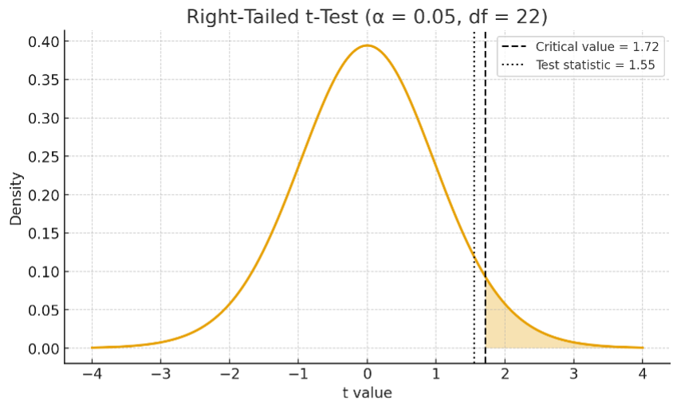
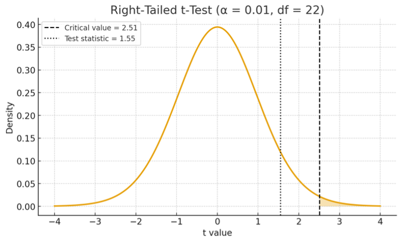
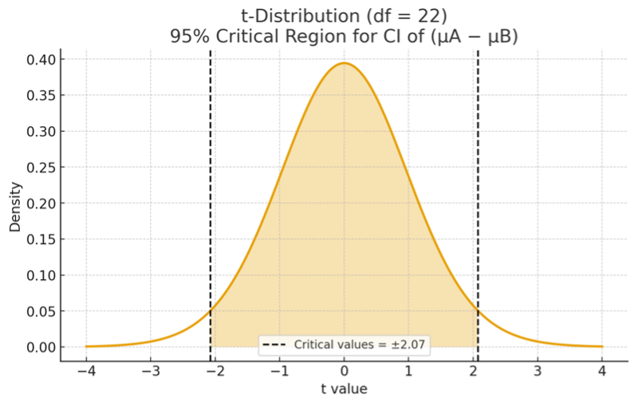
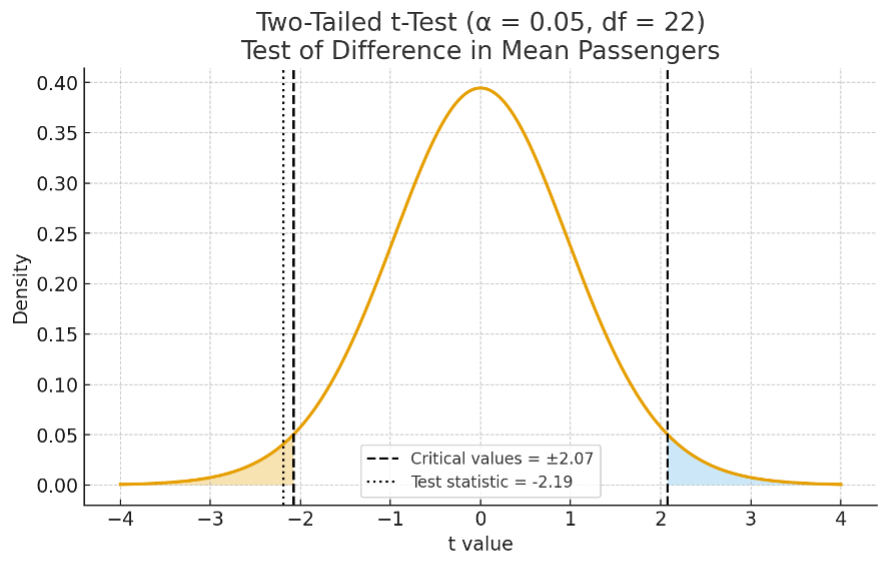
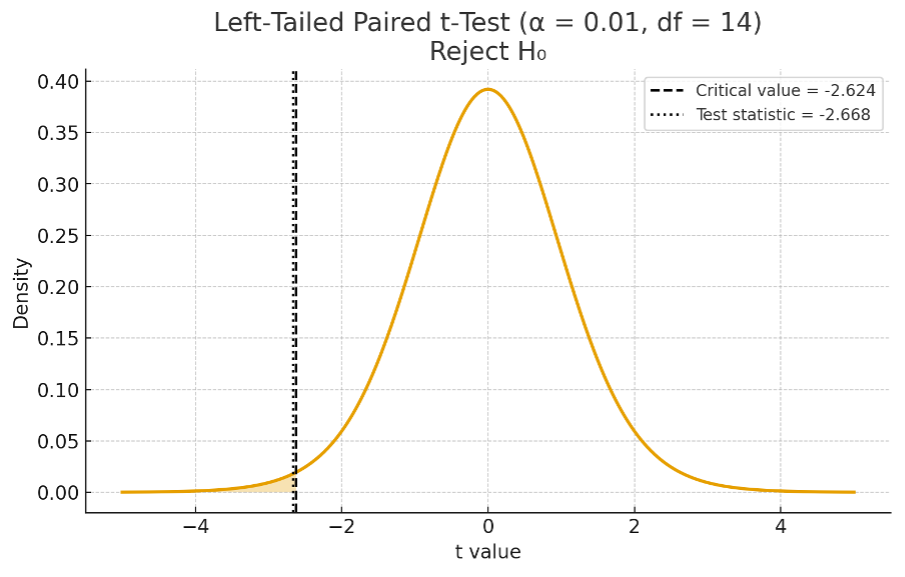
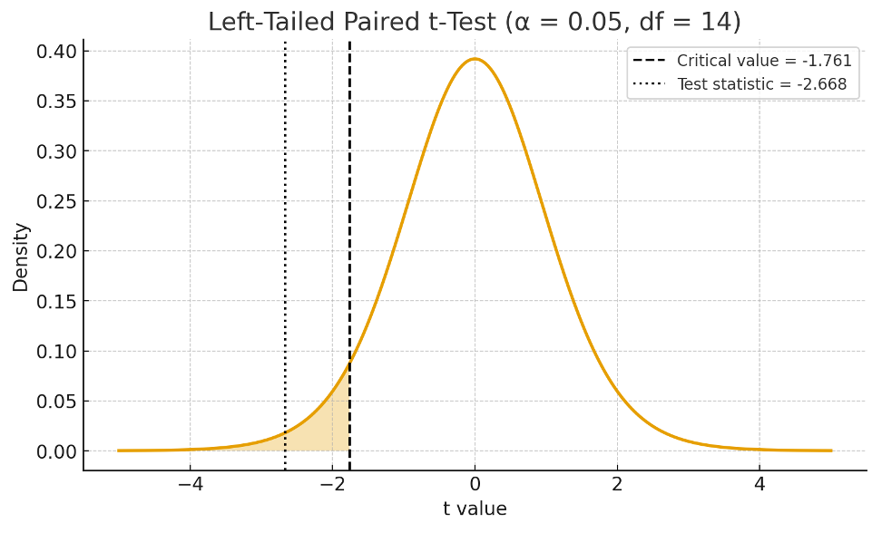
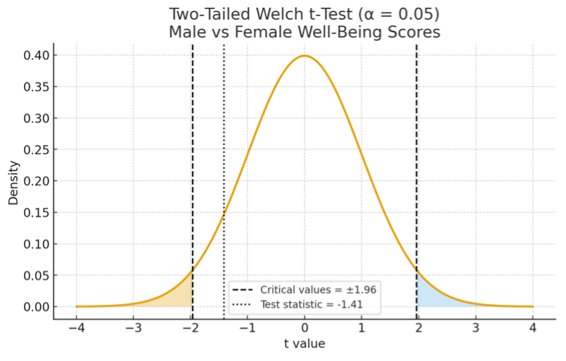

## Exercise 1

An analyst is interested in the performance of two market funds, M1 and M2. Over the past 12
months, M1 had an average monthly return of 8% with a standard deviation of 2%, whereas
M2 had an average monthly return of 10% with a standard deviation of 4%. The analyst claims
that M2 has a higher average return than M1. Assume monthly returns are normally distributed
and that the population variances of the two funds are equal.

1. Test the analyst’s claim using a 5% level of significance.

    . . .
    
    The two samples are independent. The population is normally distributed, and the population variances of the two funds are equal. Therefore, we can use the **pooled t-test** for hypothesis testing.

## Exercise 1 (Cont'd)

. . .

We first write down the hypothesis, since the analyst claims the average monthly return for M2 is higher than M1, we have: \vspace{-5pt}

. . .

$$
\begin{aligned}
H_0: \mu_{M2} - \mu_{M1} &= 0 \\
H_1: \mu_{M2} - \mu_{M1} &> 0
\end{aligned}
$$

. . .

We then calculate the pooled variance with $s_{M1}^2 = 2^2$, $s_{M2}^2 = 4^2$ and $n_{M1} = n_{M2} = 12$:

. . .

$$
\begin{aligned}
s_p^2 &= \frac{(n_{M2}-1)s_{M2}^2 + (n_{M1}-1)s_{M1}^2}{n_{M2}+n_{M1}-2} \\
      &= \frac{(12-1) 2^2 + (12-1) 4^2}{12+12-2} \\
      &= 10
\end{aligned}
$$

## Exercise 1 (Cont'd)

. . .

Next, we compute the t-test statistic with $\bar{x}_{M2}=10$, $\bar{x}_{M1}=8$, $s_p^2=10$, and $n_{M1}=n_{M2}=12$:

. . .

$$
t 
= \frac{\bar{x}_{M2}-\bar{x}_{M1}}
       {\sqrt{s_p^2\left(\frac{1}{n_{M2}} + \frac{1}{n_{M1}}\right)}}
= \frac{10 - 8}{\sqrt{10\left(\frac{1}{12} + \frac{1}{12}\right)}}
\approx 1.55.
$$

. . .

The significance level is $\alpha = 5\%$. To find the critical value for rejecting the null at this significance level, we look for the probability of 0.05 in the Student’s t-distribution table with a degree of freedom $df = n_{M2} + n_{M1} - 2 = 12 + 12 - 2 = 22$. For a right-tailed test, we look for the value $t$ such that the probability to its right is $0.05$. From the table, we find that 
$\Pr(T < 1.72) = 0.95$. Therefore, the critical value for a right-tailed test at the 5% significance level is $1.72$. Since the t-test statistic (1.55) is less than the critical value (1.72), we fail to reject the null hypothesis at the 5% level of significance.

## Exercise 1 (Cont'd)

\vspace{25pt}
{width=100%}

## Exercise 1 (Cont'd)

2. Test the analyst’s claim using a 1% level of significance.
    
    . . .
    
    The two samples are independent. The population is normally distributed, and the population variances of the two funds are equal. Therefore, we can use the pooled t-test for hypothesis testing.

    . . .
    
    We first write down the hypothesis, since the analyst claims the average monthly return for M2 is higher than M1, we have:
    
    . . .
    
    $$
    \begin{aligned}
    H_0: \mu_{M2} - \mu_{M1} &= 0 \\
    H_1: \mu_{M2} - \mu_{M1} &> 0
    \end{aligned}
    $$

## Exercise 1 (Cont'd)

. . .

We then calculate the pooled variance with $s_{M1}^2 = 2^2$, $s_{M2}^2 = 4^2$ and $n_{M1} = n_{M2} = 12$:

. . .

$$
\begin{aligned}
s_p^2 
&= \frac{(n_{M2}-1)s_{M2}^2 + (n_{M1}-1)s_{M1}^2}{n_{M2}+n_{M1}-2} \\
&= \frac{(12-1)\,2^2 + (12-1)\,4^2}{12+12-2} \\
&= 10
\end{aligned}
$$

. . .

Next, we compute the t-test statistic with $\bar{x}_{M2}=10$, $\bar{x}_{M1}=8$, $s_p^2=10$, and $n_{M1}=n_{M2}=12$:

. . .

$$
t 
= \frac{\bar{x}_{M2} - \bar{x}_{M1}}
       {\sqrt{s_p^2\left(\frac{1}{n_{M2}} + \frac{1}{n_{M1}}\right)}}
= \frac{10 - 8}{\sqrt{10\left(\frac{1}{12}+\frac{1}{12}\right)}}
\approx 1.55.
$$

## Exercise 1 (Cont'd)

. . .

The significance level is $\alpha = 1\%$. To find the critical value for rejecting the null at this significance level, we look for the probability of \(0.01\) in the Student’s t-distribution table with a degree of freedom $df = n_{M2} + n_{M1} - 2 = 12 + 12 - 2 = 22$. For a right-tailed test, we look for the value $t$ such that the probability to its right is $0.01$. From the table, we find: $\Pr(T < 2.51) = 0.99$. Therefore, the critical value for a right-tailed test at the $1\%$ significance level is $2.51$. Since the t-test statistic (1.55) is *less* than the critical value (2.51), we fail to reject the null hypothesis at the 1\% level of significance.

## Exercise 1 (Cont'd)

\vspace{25pt}
{width=100%}

## Exercise 1 (Cont'd)

3. Based on your answers to (a) and (b), suggest which investment is more attractive.
    
    . . .
    
    Based on (a) and (b), we do not find support that the M2 has a higher average monthly return compared with M1. Since M2 has a higher standard deviation than M1 which implies a higher risk/volatility, M1 is a more attractive investment. 

## Exercise 2

Two major airports are competing for the title of “Busiest Airport.” Over the past 12 years,
Airport A recorded an average of 50 million passengers per year with a standard deviation of
15 million, while Airport B recorded an average of 60 million passengers per year with a
standard deviation of 5 million. Assume that yearly passenger flows for both airports are
normally distributed and that the population variances of the two airports are equal. 

1. Construct a 95% confidence interval for the difference in the average yearly number of
passengers between Airport A and Airport B. 
    
    . . .
    
    The two samples are independent. The population is normally distributed, and the population variances of the two airports are equal. Therefore, we can use the **pooled t-test** to construct confidence interval. 

## Exercise 2 (Cont'd)

. . .

We first calculate the pooled variance with  $s_{A}^2 = 15^2$, $s_{B}^2 = 5^2$  and $n_{A} = n_{B} = 12$:

. . .

$$
\begin{aligned}
s_p^2 &= \frac{(n_A-1) s_A^2 + (n_B-1) s_B^2}{n_A+n_B-2} \\
      &= \frac{(12-1) 15^2 + (12-1) 5^2}{12+12-2} \\
      &= 125
\end{aligned}
$$

## Exercise 2 (Cont'd)

. . .

To find the confidence interval, we first need to find $t_{\alpha/2}$. We want to construct a 95\% confidence interval. Therefore, the confidence level is $1-\alpha = 0.95$, and $\alpha = 0.05$. Considering that we have a two-sided confidence interval, the error term in each tail must be $\alpha/2 = 0.025$. Thus, $\Pr(t < t_{\alpha/2}) = 0.975$. To find suitable $t_{\alpha/2} = \alpha$, search for the probability of $0.975$ among the numbers (probabilities) in the Student’s t-distribution table with $df = n_A + n_B - 2 = 12 + 12 - 2 = 22$. We find that $\Pr(t < 2.07) = 0.975$. Therefore, we have $t_{\alpha/2} = 2.07$.

## Exercise 2 (Cont'd)

. . .

Construct the confidence interval and replace $\bar{x}_A = 50$, $\bar{x}_B = 60$, $t_{\alpha/2} = 2.07$, $s_p^2 = 125$, and $n_{A} = n_{B} = 12$ as follows: \vspace{-10pt}

. . .

$$
\tiny
\begin{aligned}
(\bar{x}_A - \bar{x}_B) - t_{\alpha/2} \times \sqrt{s_p^2 \left( \frac{1}{n_A} + \frac{1}{n_{B}} \right)}
&< \mu_{A} - \mu_{B} <
(\bar{x}_A - \bar{x}_B) + t_{\alpha/2} \times \sqrt{s_p^2 \left( \frac{1}{n_{A}} + \frac{1}{n_{B}} \right)} \\
(50 - 60) - 2.07 \times \sqrt{125 \left( \frac{1}{12} + \frac{1}{12} \right)}
&< \mu_{A} - \mu_{B} <
(50 - 60) + 2.07 \times \sqrt{125 \left( \frac{1}{12} + \frac{1}{12} \right)} \\
-19.47 &< \mu_{A} - \mu_{B} < -0.53 
\end{aligned}
$$

. . .

Therefore, the 95\% confidence interval for $\mu_{A} - \mu_{B}$ is $[-19.47, -0.53]$.

## Exercise 2 (Cont'd)

\vspace{25pt}
{width=100%}

## Exercise 2 (Cont'd)

2. Using a 5% level of significance, test whether the two airports differ in their true
average yearly passenger numbers.
    
    . . .
    
    The two samples are independent. The population is normally distributed, and the population variances of the two funds are equal. Therefore, we can use the **pooled t-test** for hypothesis testing. 
        
    . . .
    
    We first write down the hypothesis, since we want to test if there is a different in true average yearly passenger numbers between the two airports, we have:
    
    . . .
    
    $$
    \begin{aligned}
    H_0: \mu_A - \mu_B &= 0\\
    H_1: \mu_A - \mu_B &\neq 0
    \end{aligned}
    $$

## Exercise 2 (Cont'd)

. . .

Since the 95\% confidence interval in (a) does not contain zero, we can reject the  $H_0: \mu_A - \mu_B = 0$ at a 5\% level of significance. That is, we find evidence that the two airports differ in their true average yearly passenger numbers.

## Exercise 2 (Cont'd)

\vspace{25pt}
{width=100%}

## Exercise 3

The cost of equity represents the required rate of return that firms must offer to raise equity
capital, where a lower cost implies more favourable financing conditions. An analyst wants to
assess whether firms have experienced an improvement in their cost of equity after 2020. To
investigate this, the analyst collects cost-of-equity data for 15 firms before and after 2020, as
shown in Table 1. 

## Exercise 3 (Cont'd)

\bigskip
| Firm | Cost of Equity (Pre 2020) | Cost of Equity (Post 2020) |
|:----:|:-------------------------:|:---------------------------:|
| 1 | 3 | 1 |
| 2 | 5 | 6 |
| 3 | 4 | 3 |
| 4 | 1 | 2 |
| 5 | 4 | 7 |
| 6 | 8 | 3 |
| 7 | 10 | 5 |
| 8 | 15 | 8 |
| 9 | 2 | 4 |
| 10 | 9 | 7 |
| 11 | 6 | 4 |
| 12 | 3 | 2 |
| 13 | 8 | 5 |
| 14 | 11 | 7 |
| 15 | 10 | 5 |

## Exercise 3 (Cont'd)

1. Test whether the cost of equity has improved for these firms after 2020 using a 1% level of
significance.
    
    . . .
    
    We therefore have $\bar{d} = -2$ and $s_d^2 = 2.9032^2$. We first write down the hypothesis, where we have: \vspace{-5pt}
    
    . . .
    
    $$
    \begin{aligned}
    H_0: \mu_d &= 0 \quad \text{(The cost of equity did not improve)} \\
    H_1: \mu_d &< 0 \quad \text{(The cost of equity improved)} 
    \end{aligned}
    $$
    
    . . .
    
    Since the data is paired, we can use the **paired t-test** for hypothesis testing. We calculate the $t$-test statistic using $\bar{d} = -2$, $n = 15$, and $s_d^2 = 2.9032^2$:
    
    . . .
    
    $$
    t = \frac{\bar{d} - \mu_d}{s_d / \sqrt{n}}
         = \frac{-2}{\,2.9032 / \sqrt{15}\,}
         \approx -2.668
    $$
    
## Exercise 3 (Cont'd)

. . .
    
The significance level is $\alpha=1\%$. To find the critical value for rejecting the null at this significance level, we look for the probability of 0.01 in the Student’s t-distribution table with a degree of freedom $df=n-1=15-1=14$. For a left-tailed test, we look for the value $t$ such that the probability to its left is 0.01. From the table, we find that $Pr(T <-2.624)= 0.01$. Therefore, the critical value for a left-tailed test at the 1% significance level is -2.624. Since the $t$-test statistic (-2.668) is *less* than the critical value (-2.624), we reject the null hypothesis at the 1% level of significance. This suggests there is support for the claim that the cost of equity has improved after 2020. 

## Exercise 3 (Cont'd)

\vspace{25pt}
{width=100%}

## Exercise 3 (Cont'd)

2. Based on your result in part (a), discuss whether any conclusion would change if the test
were conducted at the 5% level of significance instead. Explain your reasoning.
    
    . . .
    
    Since we reject the null at 1% level of significance in (a), we must be able to reject the same null at 5% level of significance which requires a less extreme test statistic to reject the null hypothesis.
    
## Exercise 3 (Cont'd)

\vspace{25pt}
{width=100%}

## Exercise 4

A university is interested in the well-being of its students and conducts a survey. Well-being is
measured on a scale from 0 to 10. A sample of 1,000 male students reports an average wellbeing score of 6 with a standard deviation of 2. A separate sample of 1,000 female students
reports an average well-being score of 6.1 with a standard deviation of 1. Assume the scores
are normally distributed and that the population variances for male and female students are not
equal.

1. Test whether the average well-being score of male students is different from that of
female students at the 5% level of significance.
    
    . . .
    
    The two samples are independent. The population is normally distributed, and the population variances of the two samples are unequal. Therefore, we can use the **Welch's t-test** for hypothesis testing. 

## Exercise 4 (Cont'd)

. . .

We first write down the hypothesis, since we want to test for differences in wellbeing of male and female students, we have: \vspace{-2pt}

. . .

$$
\begin{aligned}
H_0: \mu_M - \mu_F &= 0 \\
H_1: \mu_M - \mu_F &\neq 0
\end{aligned}
$$

. . .

Next, we compute the t-test statistic with $\bar{x}_M = 6$, $\bar{x}_F = 6.1$, $s_M^2 = 2^2$, $s_F^2 = 1^2$, and $n_M = n_F = 1000$:

. . .

$$
\frac{\bar{x}_M - \bar{x}_F}
     {\sqrt{\frac{s_M^2}{n_M} + \frac{s_F^2}{n_F}}}
=
\frac{6 - 6.1}{\sqrt{\frac{2^2}{1000} + \frac{1^2}{1000}}}
\approx -1.41
$$

## Exercise 4 (Cont'd)

. . .

Since the sample size is large, Student’s t-distribution converges to the Standard normal distribution. The significance level is $\alpha=5%$. To find the critical value for rejecting the null at this significance level, we look for the probability of 0.05 in the Standard normal table. For a two-tailed test, we look for the value $t$ such that the probability to both its left and right is 0.025. From the table, we find that $Pr(T <1.96)= 0.975$. Therefore, the critical value for a two-tailed test at the 5% significance level is ±1.96. Since the absolute value of the t-test statistic (1.41) is *less* than the critical value (1.96), we fail to reject the null hypothesis at the 5% level of significance.

## Exercise 4 (Cont'd)

2. A student union body claims that male and female students are equally well in the
university. Comment on this claim.
    
    . . .
    
    Since we fail to reject the null hypothesis in (a), we can at most say we do not find support for a difference in the wellbeing of male and female students. We cannot make any claim about the null itself. 
    
## Exercise 4 (Cont'd)

\vspace{25pt}
{width=100%}

    

