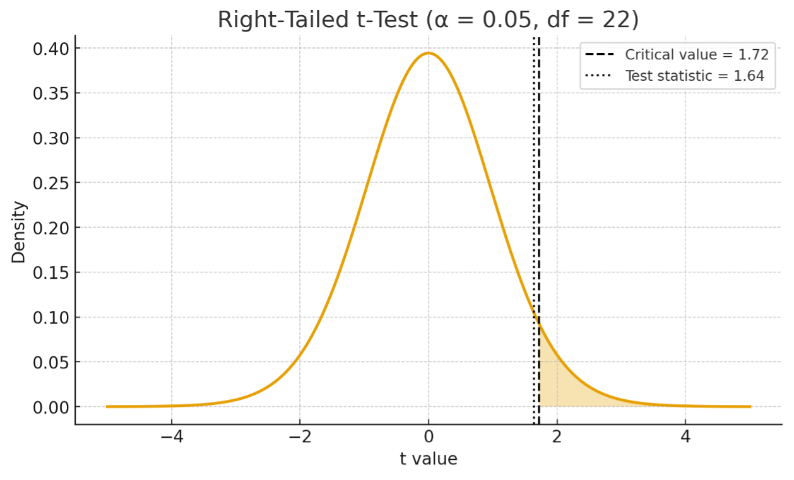
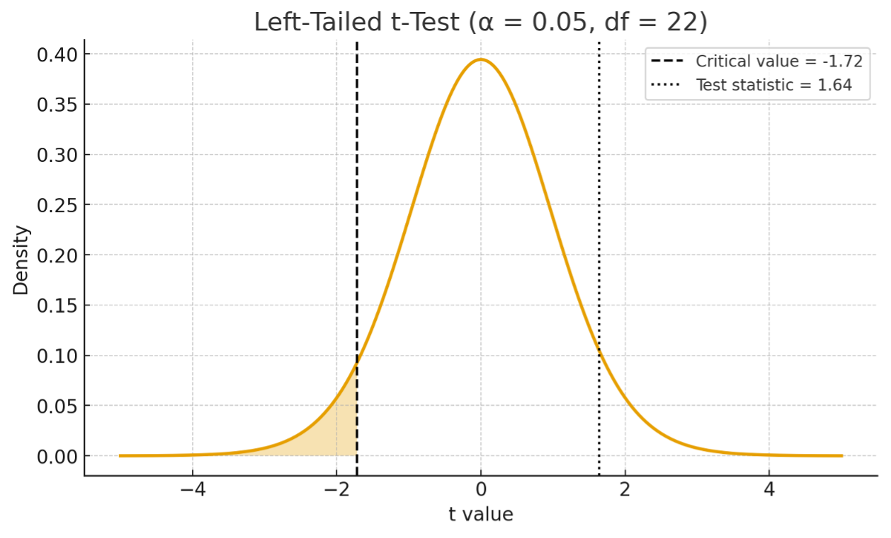
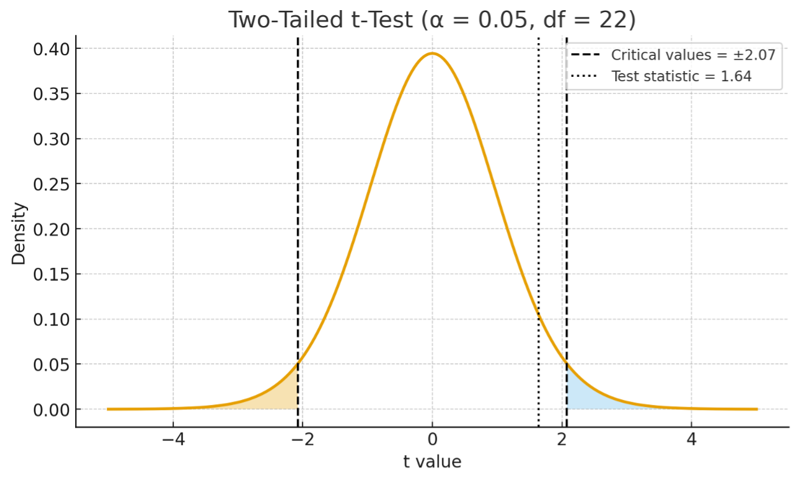
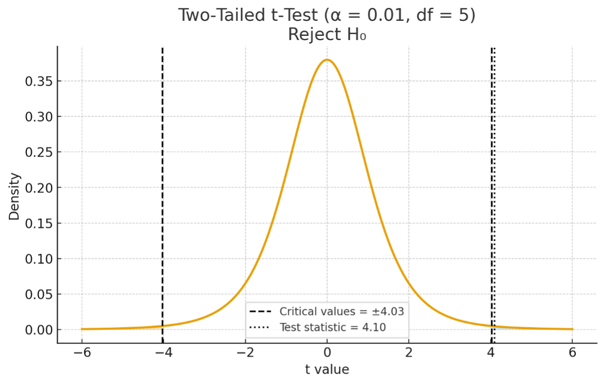
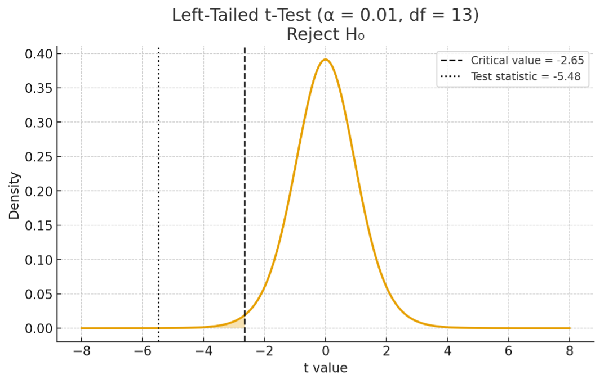

## Exercise 1

Suppose two cryptocurrencies’ monthly returns have a correlation coefficient of 0.33 based on observations from the previous 24 months. 

. . .

1. Test the claim that the correlation is greater than zero using a 5% level of significance.
    
    . . .
    
    The correlation coefficient is 0.33 and the sample size is 24. Therefore, we have 
    
    . . .
    
    $$
    t=r\sqrt{\frac{{n-2}}{1-r^2}} = 0.33\sqrt{\frac{24-2}{1-0.33^2}} \approx 1.64
    $$
    
    . . .
    
    $$
    \begin{aligned}
    H_0 &: \rho = 0 \\
    H_1 &: \rho > 0
    \end{aligned}
    $$

## Exercise 1 (Cont'd)

. . .

The significance level is $\alpha=5\%$. To find the critical value for rejecting the null at this significance level, we look for the probability of 0.05 in the **Student’s t-distribution** table with a degree of freedom $df=n-2=24-2=22$. For a **right-tailed test**, we look for the value t such that the probability to its **right** is 0.05. From the table, we find that $Pr(T <1.72) = 0.95$. Therefore, the critical value for a right-tailed test at the 5% significance level is 1.72. Since the t-test statistic (1.64) is *less* than the critical value (1.72), we fail to reject the null hypothesis at a 5% level of significance.

## Exercise 1 (Cont'd)

. . . 

\vspace{15pt}
{fig-align="center" width="95%"}

## Exercise 1 (Cont'd)

2. Test the claim that the correlation is less than zero using a 5% level of significance.\vspace{-5pt}
    
    . . .
    
    $$
    \begin{aligned}
    H_0 &: \rho = 0 \\
    H_1 &: \rho < 0
    \end{aligned}
    $$
    
    . . .
    
    The significance level is $\alpha=5\%$. To find the critical value for rejecting the null at this significance level, we look for the probability of 0.05 in the **Student’s t-distribution** table with a degree of freedom $df=n-2=24-2=22$. For a **left-tailed test**, we look for the value t such that the probability to its **left** is 0.05. From the table, we find that $Pr(T>-1.72)= 0.95$. Therefore, the critical value for a left-tailed test at the 5% significance level is -1.72. Since the t-test statistic (1.64) is *greater* than the critical value (-1.72), we fail to reject the null hypothesis at a 5% level of significance.

## Exercise 1 (Cont'd)

. . .

\vspace{15pt}
{fig-align="center" width="95%"}

## Exercise 1 (Cont'd)

3. Test the claim that the correlation is different from zero using a 5% level of significance. \vspace{-5pt}
    
    . . .
    
    $$
    \begin{aligned}
    H_0 &: \rho = 0 \\
    H_1 &: \rho \neq 0
    \end{aligned}
    $$
    
    . . .
    
    The significance level is $\alpha=5\%$. To find the critical value for rejecting the null at this significance level, we look for the probability of $0.05/2=0.025$ in the **Student’s t-distribution** table with a degree of freedom $df=n-2=24-2=22$. For a **two-tailed test**, we look for the value $t$ such that the probability to its **left and right** is 0.025. From the table, we find that $Pr(T>2.07)= 0.975$. Therefore, the critical value for a two-tailed test at the 5% significance level is ±2.07. Since the t-test statistic (1.64) is between than the critical values (±2.07), we fail to reject the null hypothesis at a 5% level of significance.
    
## Exercise 1 (Cont'd)

. . .

\vspace{15pt}
{fig-align="center" width="95%"}

## Exercise 2

\begin{table}[h!]
\centering
\begin{tabular}{cc}
\hline
Y & X \\
\hline
2   & 1 \\
4   & 2 \\
8   & 3 \\
16  & 4 \\
32  & 5 \\
64  & 6 \\
128 & 7 \\
\hline
\end{tabular}
\end{table}

## Exercise 2 (Cont'd)

1. Estimate a regression of Y on X and interpret your results.
    
    . . .
    
    We have $\hat{\beta}_1 = \frac{522}{28} \approx 18.64$. Therefore, we have $\hat{\beta}_0 = 36.29 - 18.64 \times 4 = -38.29$. The estimated regression is then: $Y = -38.29 + 18.64 \times X + Error$. $\hat{\beta}_0$ suggests the predicted value of $Y$ is -38.29 when $X$ is zero and $\hat{\beta}_1$ of 18.64 suggests an increase of one unit of $X$ is associated with 18.64 unit increase in $Y$. 
    
## Exercise 2 (Cont'd)

2. Test if the slope coefficient is significantly different from zero at 1% level of significance. (The standard error for the slope coefficient is 4.55)

    . . .
    
    From (1), $\hat{\beta}_1 = 18.64$, and $SE(\hat{\beta}_1) = 4.55$:
    
    . . .
    
    $$
    \begin{aligned}
    H_0 &: \beta_1 = 0 \\
    H_1 &: \beta_1 \neq 0
    \end{aligned}
    $$
    
    . . .
    
    Next, we have the test statistic as follows
    
    . . .
    
    $$
    t = \frac{\hat{\beta_1} - 0}{SE(\hat{\beta_1})} = \frac{18.64 - 0}{4.55} \approx 4.1
    $$

## Exercise 2 (Cont'd)

. . .

The significance level is $\alpha=1\%$. To find the critical value for rejecting the null at this significance level, we look for the probability of $0.01/2=0.005$ in the **Student’s t-distribution** table with a degree of freedom $df=n-2=7-2=5$. For a **two-tailed test**, we look for the value t such that the probability to its **left and right** is 0.005. From the table, we find that $Pr(T>4.03)= 0.995$. Therefore, the critical value for a two-tailed test at the 5% significance level is ±4.03. Since the t-test statistic (4.1) is *greater* than the critical values (4.03), we reject the null hypothesis at a 5% level of significance.

## Exercise 2 (Cont'd)

. . .

\vspace{15pt}
{fig-align="center" width="95%"}

## Exercise 2 (Cont'd)

3. Compute the coefficient of determination and interpret your results.
    
    . . .
    
    The coefficient of determination for a simple linear regression can be computed as the square of the correlation coefficient. Therefore, we have: \vspace{-5pt}
    
    . . .
    
    $$
    R^2= \bigg(\frac{Cov(X,Y)}{S_X S_Y}\bigg)^2= \bigg(\frac{87}{2.16 \times 45.88}\bigg)^2=0.77.
    $$
    
    . . .
    
    This suggests the model explains 77% of variation in Y. 

## Exercise 2 (Cont'd)

4. Predict the value of Y when X is 3 and when X is 8.
    
    . . .
    
    When $X=3$, we have $Y= -38.29+18.64 \times 3=17.64$. Since $X=8$ is out of the data range used to estimate the regression, we cannot predict the value of $Y$ as this would lead to extrapolation.

## Exercise 3

The cost of debt represents the required rate of return that firms must offer to raise debt capital, where a lower cost implies more favourable financing conditions. An analyst claims firms with more sales can assess lower cost of debt. To investigate this, the analyst collects cost-of-debt data for 15 firms, as shown in Table 1

## Exercise 3 (Cont'd)

1. Estimate the regression of Cost of Debt on Sales and interpret the estimated coefficients. 
    
    . . .
    
    We have $\hat{\beta}_1 = \frac{-239.27}{427.73} \approx -0.56$. Therefore, we have $\hat{\beta}_0 = 6.47-0.56 \times 7.47=10.64$. The estimated regression is then: $Cost of Debt= 10.64-0.56 \times Sales+Error$. $\hat{\beta}_0$ of 10.64 suggests the predicted Cost of Debt is 10.64% when Sales are zero and $\hat{\beta}_1$ of -0.56 suggests an increase of one unit of Sales is associated with 0.56 unit decrease in Cost of Debt. 
    
## Exercise 3 (Cont'd)

2. Using the reported standard error of the slope coefficient (0.10), test the analyst’s  claim at the 1% level of significance. 
    
    . . .
    
    From (1), $\hat{\beta}_1 = -0.56$, and $SE(\hat{\beta}_1) = 0.10$
    
    . . .
    
    $$
    \begin{aligned}
    H_0 &: \beta_1 = 0 \\
    H_1 &: \beta_1 < 0 \\
    \end{aligned}
    $$
    
    . . .
    
    Next, we have the test statistic as follows
    
    . . .
    
    $$
    t = \frac{\hat{\beta}_1 - 0}{SE(\hat{\beta}_1)} = \frac{-0.56 - 0}{0.10} \approx -5.48
    $$
    
## Exercise 3 (Cont'd)

. . .

The significance level is $\alpha=1\%$. To find the critical value for rejecting the null at this significance level, we look for the probability of 0.01 in the **Student’s t-distribution** table with a degree of freedom $df=n-2=15-2=13$. For a **left-tailed test**, we look for the value t such that the probability to its **left** is 0.01. From the table, we find that $Pr(T>-2.65)= 0.99$. Therefore, the critical value for a left-tailed test at the 5% significance level is -2.65. Since the t-test statistic (-5.48) is *less* than the critical values (-2.65), we reject the null hypothesis at a 1% level of significance.

## Exercise 3 (Cont'd)

. . .

\vspace{15pt}
{fig-align="center" width="95%"}

## Exercise 3 (Cont'd)

3. Compute the coefficient of determination ($R^2$) for the regression and interpret its meaning in context. 
    
    . . .
    
    The coefficient of determination for a simple linear regression can be computed as the square of the correlation coefficient. Therefore, we have \vspace{-5pt}
    
    . . .
    
    $$
    R^2 = \bigg(\frac{Cov(X, Y)}{S_X S_Y} \bigg)^2 = \bigg(\frac{-17.09}{3.70 \times 5.53} \bigg)^2 = 0.70
    $$
    
    . . .
    
    This suggests the model explains 70% of variation in Cost of Debt. 
    
## Exercise 3 (Cont'd)

4. Suppose the true model includes another variable that affects the Cost of Debt and is also correlated with Sales, but this variable is omitted from the regression. Discuss how this omission would affect the estimated slope coefficient. No Calculations Required. 
    
    . . .
    
    Omitting a variable that is correlated with Sales and affects Cost of Debt would lead to **omitted variable bias**. This would lead to a biased estimation of the coefficient for Sales.
    
## Exercise 3 (Cont'd)

5. If an additional explanatory variable is added to the regression and the $R^2$ value increases, can we conclude that the new model is better? Answer Yes or No. If your answer is No, explain why and describe the correct criterion for model comparison.
    
    . . .
    
    No as $R^2$ can increase mechanically when we add additional variable into the model, regardless of whether the additional variable contains information or not. A better measurement would be to examine the adjusted $R^2$ which accounts for degrees of freedom. 

## Exercise 4

A labour economist estimates the following multiple linear regression model for hourly wage (in £) \vspace{-15pt}

$$
Wage=5.0+0.8 \times Schooling+0.3 \times Experience+2.5 \times Male+u 
$$

where:
	
* Schooling = years of education,

* Experience = years of labour-market experience, 

* Male = 1 if the worker is male, 0 if female. 
    
The regression is based on a sample of 100 workers. The reported $R^2$ is 0.78. 

## Exercise 4 (Cont'd)

1. Interpret each coefficient in the regression model. 
    
    . . .
    
    The intercept of 5.0 suggests the predicted wage is £5 per hour for a female worker (Male = 0) with 0 years of schooling and 0 years of experience. Schooling (0.8) suggests each additional year of schooling is associated with an increase of £0.80 per hour in wage on average, holding **experience** and **gender** fixed. Experience (0.3) suggests each extra year of labour-market experience is associated with an increase of £0.30 per hour in wage on average, holding **schooling** and **gender** fixed. Male (2.5) suggests male workers earn £2.50 per hour more than otherwise similar female workers on average, holding **schooling** and **experience** fixed.

## Exercise 4 (Cont'd)

2. Compute the adjusted $R^2$. Explain what $R^2$ and adjusted $R^2$ each measure, and which is more useful when comparing models. 
    
    . . .
    
    We are given that $R^2=0.78$, $n=100$, and $k=3$ \vspace{-15pt}
	
	. . .
	
	$$
	\begin{aligned}
    Adjusted\; R^2&=1-(1-R^2 )\frac{(n-1)}{(n-k-1)} \\ &=1-(1-0.78)\frac{(100-1)}{(100-3-1)}\approx0.773
    \end{aligned}
    $$

## Exercise 4 (Cont'd)

. . .

Therefore, the adjusted $R^2$ is approximately 0.773. $R^2=0.78$ suggests about 78% of the variation in wages in the sample is explained by the linear relationship with schooling, experience, and gender. Adjusted $R^2=0.773$ is similar, but it penalises the model for including more explanatory variables. It adjusts for degrees of freedom so that adding a useless regressor does not artificially inflate the goodness of fit. When comparing models with different numbers of regressors, adjusted $R^2$ is more useful, because it penalises overfitting and only increases when a new variable improves the fit “enough”.
    
## Exercise 4 (Cont'd)

3. Suppose we re-estimate the model but omit Schooling from the regression. Discuss what is likely to happen to the estimated coefficients and why. **No Calculations Required**.
    
    . . .
    
    Schooling is almost certainly correlated with wage and likely correlated with experience and gender (e.g. men and women may have different average schooling; more schooling might be linked to different career paths and thus experience). Leaving out an important, correlated variable leads to **omitted variable bias**. The new coefficients on **Experience** and **Male** will generally be biased and inconsistent: they will now partly pick up the effect of schooling, because the model is forcing them to explain variation that belongs to the omitted variable (i.e. **Schooling**). 
